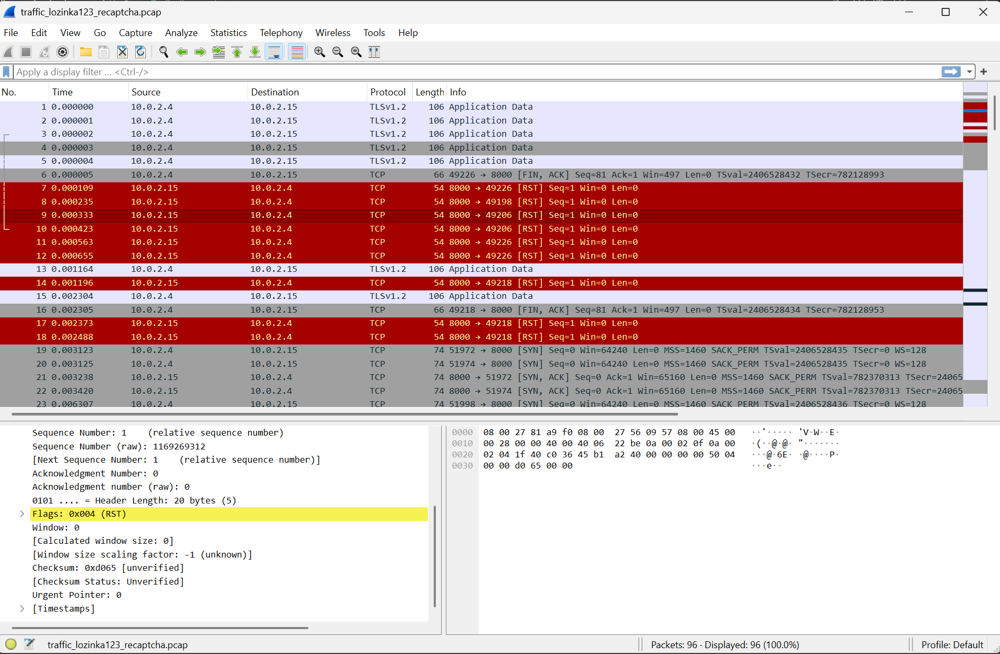
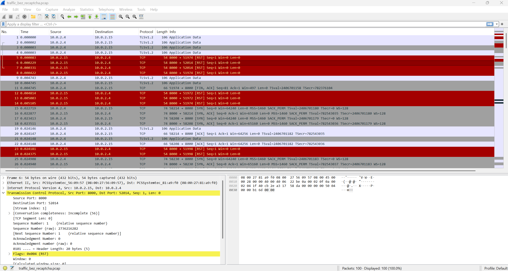

# Rezultati kod izrade mreže virtualnih strojeva - uključen reCAPTCHA
(Pogledati lozinka123_recaptcha.csv i traffic_lozinka123_recaptcha.pcap)

Radi se o ispitivanju ponašanja login API‑ja unutar virtualne mreže u kojoj je klijent na adresi 10.0.2.4, a poslužitelj na 10.0.2.15, pri čemu je korišten fuzzing nad parametrima korisničkog imena i lozinke, dok je mrežni promet sniman na razini TCP‑a i TLS‑a pomoću Wiresharka. Cilj ispitivanja je bio procijeniti robusnost poslužiteljske aplikacije na različite ulazne vrijednosti te provjeriti utječe li kompleksnija mrežna topologija i kriptiracija prometa na njezino ponašanje.

## Predmet ispitivanja

Predmet testiranja je REST endpoint POST https://10.0.2.15:8000/api/login, kojem se pristupa iz virtualne mreže preko TLS tunela. Fokus je na reakciji poslužitelja na ispravno formiran HTTP zahtjev s pogrešnim vjerodajnicama te na više fuzziranih varijanti zahtjeva u kojima se mijenja sadržaj tijela poruke (različiti identifikatori, lozinka lozinka123, znak točke i druge atipične kombinacije vrijednosti).

## Proces ispitivanja

Uspostavljena je virtualna mreža s dva virtualna stroja: klijentskim sustavom (10.0.2.4) i poslužiteljskim sustavom (10.0.2.15), čime je simuliran realan TCP/IP promet između više čvorova. Na klijentskom sustavu korišten je alat za fuzzing HTTP zahtjeva (OWASP ZAP) kojim je prema navedenom endpointu prvo poslan originalni login zahtjev, a zatim četiri fuzzirana zahtjeva, dok je na mrežnom sloju istovremeno bilježen TLSv1.2 i TCP promet pomoću Wiresharka.

## Rezultati ispitivanja

Ukupno je zabilježeno pet HTTP zahtjeva: jedan originalni i četiri fuzzirana (Task ID 0–4). Svi zahtjevi rezultirali su neuspješnim pokušajem prijave; originalni zahtjev vraća statusni kod HTTP 401 Unauthorized, dok sva četiri fuzzirana zahtjeva vraćaju HTTP 400 Bad Request, pa se zaključuje da nema uspješnih (prošlih) testova, već je svih pet završilo statusom neuspjeha.

Originalni zahtjev (Task ID 0) ima relativno malo tijelo (37 bajtova), što odgovara tipičnom JSON formatu s poljima za korisničko ime i lozinku i rezultira kontroliranim odgovorom 401 Unauthorized, što ukazuje na očekivano ponašanje autentikacijskog mehanizma. Fuzzirani zahtjevi imaju znatno veće tijelo zahtjeva (oko 1593–1602 bajta) s neuobičajenim kombinacijama identifikatora i lozinke (npr. [48425966747, lozinka123], [15082092164, .]), pri čemu poslužitelj na sve takve zahtjeve odgovara kodom 400 Bad Request, što sugerira da se greška generira već na razini validacije ulaza ili parsiranja HTTP tijela.

Na razini TCP prometa uočava se veći broj paketa s oznakom RST, što upućuje na to da jedna strana, agresivno prekida TCP konekciju nakon obrade zahtjeva ili detekcije greške. Paralelno se bilježe TLSv1.2 „Application Data“ zapisi, što potvrđuje da je HTTP promet ispravno tuneliran kroz TLS te da poslužitelj uspijeva isporučiti odgovarajuće HTTP statusne kodove (401 i 400) prije slanja RST paketa i konačnog zatvaranja sesije.

## Uočene nepravilnosti i neočekivana ponašanja

Neočekivanim se može smatrati to što svi fuzzirani zahtjevi završavaju istim statusnim kodom 400 Bad Request, bez pojave statusnog koda 500 ili drugih indikacija poslužiteljskih iznimki, što implicira da aplikacija ostaje stabilna i na neuobičajene, opsežne ulazne podatke te ih odbacuje kontrolirano. Dodatno, učestala i uzastopna uporaba TCP RST paketa od strane poslužitelja (prema klijentu) može upućivati na postojanje dodatnih zaštitnih mehanizama, poput web aplikacijskog vatrozida ili ograničavanja broja pokušaja prijave, koji nasilno prekidaju veze pri detekciji sumnjivog ili prekomjernog prometa.

No, ovakvo ponašanje sustava smatra se u potpunosti očekivanim i poželjnim, jer je u procesu autentikacije uključena provjera reCAPTCHA mehanizma. Integracija reCAPTCHA‑e uzrokuje da se neuobičajeni ili automatizirani zahtjevi (kao što su fuzzirani login pokušaji) tretiraju kao nevaljani te rezultiraju statusnim kodovima 400 Bad Request ili 401 Unauthorized, bez dublje obrade u aplikacijskoj logici.

To znači da poslužitelj ispravno prepoznaje sumnjive obrasce ponašanja, ne dopušta prolaz takvim zahtjevima i pritom ostaje stabilan, bez padova ili generiranja poslužiteljskih grešaka. Takav ishod pokazuje da sigurnosni mehanizmi (uključujući reCAPTCHA) učinkovito štite login endpoint od automatiziranih napada i zlouporabe.

# Rezultati kod izrade mreže virtualnih strojeva - isključen reCAPTCHA
(bez_recaptcha.csv i traffic_bez_recaptcha.pcap)

Radi se o ispitivanju ponašanja istog login API‑ja u virtualnoj mreži, ali u konfiguraciji bez uključene reCAPTCHA provjere, pri čemu je ponovno korišten fuzzing nad parametrima korisničkog imena i lozinke, a mrežni promet je analiziran na razini TCP‑a i TLS‑a u Wiresharku. Cilj je bio usporediti robusnost i reakcije sustava u odnosu na varijantu s uključenom reCAPTCHA‑om.

## Predmet ispitivanja

Kao i u prethodnom scenariju, predmet testiranja je REST endpoint POST https://10.0.2.15:8000/api/login, kojem se pristupa iz virtualne mreže preko TLS tunela. Fokus je na tome kako se backend ponaša kada prima ispravno formirane HTTP zahtjeve bez dodatne reCAPTCHA validacije, te kako reagira na više fuzziranih varijanti tijela zahtjeva u kojima se nalaze različiti identifikatori i vrijednosti lozinke.

## Proces ispitivanja

U virtualnoj mreži su ponovno korištena dva virtualna stroja: klijent na adresi 10.0.2.4 i poslužitelj na 10.0.2.15, čime je simuliran stvarni TCP/IP promet između odvojenih čvorova. Na klijentu je korišten alat za fuzzing HTTP zahtjeva koji je slao originalni login zahtjev i četiri fuzzirana zahtjeva prema istom URL‑u, dok je Wireshark bilježio TLSv1.2 i TCP sesije, ali ovaj put bez utjecaja reCAPTCHA sloja na aplikacijskoj razini.

## Rezultati ispitivanja

CSV zapis pokazuje da je broj zahtjeva jednak kao u prethodnom testu (jedan originalni i četiri fuzzirana), pri čemu endpoint i dalje vraća neuspješne ishode prijave, ali se mogu uočiti razlike u statusnim kodovima i veličinama tijela zahtjeva/odgovora u odnosu na konfiguraciju s reCAPTCHA‑om. Većina testnih slučajeva završava neuspješno (nema uspješnih prijava).  Jedino zadnji slučaj završava pozitivnim ishodom (status 200) kada je uspješna prijava (OIB: 48425966747, LOZINKA: lozinka123). Odgovori poslužitelja odražavaju odsutnost dodatne validacije na strani reCAPTCHA‑e, što se vidi u drukčijim HTTP kodovima i strukturi odgovora.

U ovom scenariju originalni i fuzzirani zahtjevi prolaze direktno do autentikacijskog mehanizma, pa se tijela zahtjeva i odgovora razlikuju u odnosu na varijantu s reCAPTCHA‑om, dok statusni kodovi upućuju na to da su zahtjevi obrađeni prvenstveno logikom za provjeru vjerodajnica. Na razini TCP‑a i dalje su vidljivi RST paketi kojima poslužitelj prekida konekcije nakon završetka obrade ili pri detekciji greške, a TLSv1.2 „Application Data“ upućuje na to da je HTTP promet i dalje u potpunosti kriptiran kroz TLS tunel.

## Uočene nepravilnosti i neočekivana ponašanja

U usporedbi s konfiguracijom s uključenom reCAPTCHA‑om, u ovoj varijanti se jasno vidi da sustav obrađuje fuzzirane zahtjeve “dublje” u aplikacijskoj logici, jer nema dodatnog sloja koji bi ih rano odbacio, što se očituje u drukčijim statusnim kodovima i veličinama tijela odgovora. Ipak, ni u scenariju bez reCAPTCHA‑e nije uočeno rušenje aplikacije ili generiranje poslužiteljskih 500 grešaka, što potvrđuje da je login API relativno otporan i u ovoj konfiguraciji, iako mu nedostaje dodatni sigurnosni sloj zaštite koji u prethodnom testu pruža reCAPTCHA.​ Također, sustav je za obrađene testne slučajeve dao očekivane rezultate.